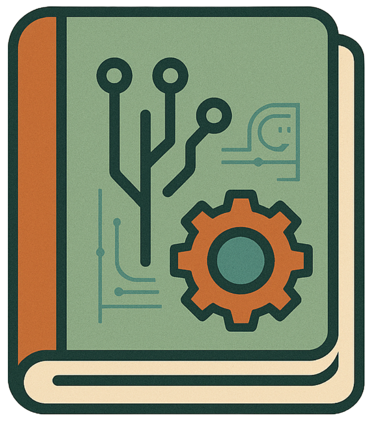

# :floppy_disk: Engineered Log

Welcome to the source code of my personal website - [Engineered Log](https://engineeredlog.vercel.app/). This site is a hub for my ideas, projects, and interests, providing a window into my work and ongoing explorations in software engineering and beyond.

<p align="center">
  
</p>

It is built using:
- **Next.js** (React framework) v15.3.2
- **Tailwind CSS** v4.x
- **JavaScript**
- **MDX** for content
- **Vercel** for deployment

---

## :construction: RoadMap & TODO

The core functionality of the website is now complete. Remaining features and sections are considered lower priority and will be added gradually as time allows:
- [x] ~~Refine Home page~~
- [x] ~~Refine NavBar Icons~~
- [x] ~~Refine Sidebar Notes\projects~~
- [x] ~~Learn more about Note server-side~~
- [x] ~~Refractor Style Code \ Refine Color Schema~~
- [x] ~~Fix Dark Mode~~ (solved, but intefficient) 
- [x] ~~About Me section~~
  - [ ] Books  
  - [ ] Chess  
  - [ ] productivity  
- [ ] ~~Contact form~~  
- [x] ~~Update Projects~~
  - [x] ~~Update Projects Images~~

---

## :books: Citations & Inspiration

This project is inspired and informed by several fantastic resources. Here are some of the main influences:

- The website design is heavily inspired by [Tania Rascia’s website](https://www.taniarascia.com/). (I hope that's okay—I'm not great at design, but I'm good at “getting inspired.”)
- My motivation for building this site came from reading [Mr. RIP’s blog](https://retireinprogress.com/) and exploring his "knowledge source."
- All illustrations are sourced from [StorySet](https://storyset.com).
- For more inspiration and templates, I also refer to the excellent [Portfolio Ideas repository](https://github.com/Evavic44/portfolio-ideas).

---

## 🚀 Getting Started

To run this project locally:

```bash
git clone https://github.com/GppCalcagno/engineered_log.git
cd engineered_log
npm install
npm run dev
```
Visit `http://localhost:3000` in your browser.

---

## 🤝 Contributing

Contributions, suggestions, and ideas are welcome! Please open an issue or pull request if you'd like to help improve the site.

